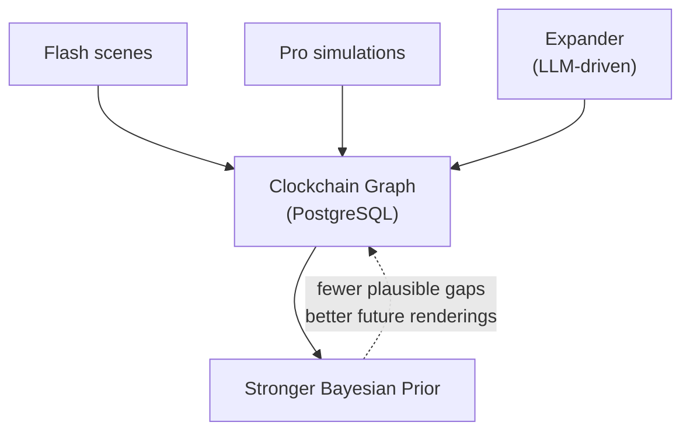
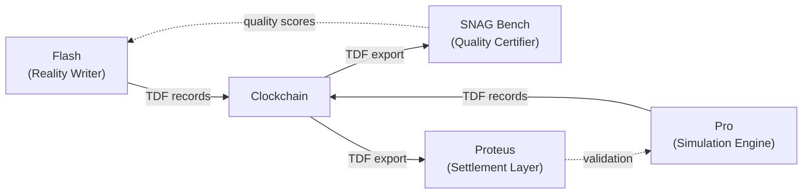

## Overview

Timepoint AI is a suite of open-source engines for rendering the past, simulating the future, scoring predictions, and accumulating a causal graph. Clockchain is the **temporal causal graph** that all other services read from and write to.

<Note>
Render the past. Simulate the future. Score the predictions. Accumulate the graph.
</Note>

## Architecture

The Timepoint suite implements a **Rendered Past / Rendered Future** framework:

- **Rendered Past** — historical events rendered by Flash with full causal structure, entity states, dialog, and source grounding
- **Rendered Future** — simulation outputs from Pro, scored for convergence and stored as TDF records

Each new event with causal edges tightens the Bayesian prior — fewer plausible things could have happened in the gaps — approaching asymptotic coverage of any historical period.



## Open-Source Engines

<CardGroup cols={2}>
  <Card title="Flash" icon="bolt" href="https://github.com/timepoint-ai/timepoint-flash">
    **Reality Writer** — renders grounded historical moments (Synthetic Time Travel)
  </Card>
  
  <Card title="Pro" icon="chart-line" href="https://github.com/timepoint-ai/timepoint-pro">
    **Simulation Engine** — SNAG-powered temporal simulation, TDF output
  </Card>
  
  <Card title="Clockchain" icon="clock">
    **Temporal Causal Graph** — Rendered Past + Rendered Future, growing 24/7 (this service)
  </Card>
  
  <Card title="SNAG Bench" icon="certificate" href="https://github.com/timepoint-ai/timepoint-snag-bench">
    **Quality Certifier** — measures Causal Resolution across renderings
  </Card>
  
  <Card title="Proteus" icon="chart-mixed" href="https://github.com/timepoint-ai/proteus-markets">
    **Settlement Layer** — prediction markets that validate Rendered Futures
  </Card>
  
  <Card title="TDF" icon="file-code" href="https://github.com/timepoint-ai/timepoint-tdf">
    **Data Format** — JSON-LD interchange across all services
  </Card>
</CardGroup>

## Flash Integration

**Flash** is the Reality Writer that renders grounded historical moments with full narrative, dialog, entity states, and source citations.

### How Flash Feeds Clockchain

1. **Scene Generation** — Flash renders a historical moment as an immersive scene
2. **TDF Export** — Flash exports the event metadata as a TDF record
3. **Clockchain Indexing** — Clockchain ingests the TDF record and creates a graph node
4. **Auto-linking** — Clockchain automatically creates edges for temporal, spatial, and thematic relationships

### API Flow

Clockchain's `/api/v1/generate` endpoint queues scene generation with Flash:

```python
# From app/workers/renderer.py
class FlashRenderer:
    async def generate_sync(self, params: dict) -> dict:
        """Request scene generation from Flash."""
        async with httpx.AsyncClient() as client:
            resp = await client.post(
                f"{self.flash_url}/api/v1/generate",
                json=params,
                headers={"X-Service-Key": self.flash_key},
                timeout=120,
            )
            return resp.json()
```

Once the scene is complete, Clockchain polls for the result and indexes it in the graph with full provenance.

## Pro Integration

**Pro** is the Simulation Engine that generates Rendered Futures — temporal simulations scored for convergence.

### How Pro Feeds Clockchain

1. **Simulation Run** — Pro runs a SNAG-powered temporal simulation
2. **TDF Output** — Pro exports simulated events as TDF records with confidence scores
3. **Ingest** — Clockchain ingests Pro's TDF records via `/api/v1/ingest/tdf`
4. **Source Typing** — Nodes are marked with `source_type: "simulation"`

### TDF Ingest Endpoint

Pro posts TDF records to Clockchain (app/api/ingest.py:60):

```bash
curl -X POST https://clockchain.timepointai.com/api/v1/ingest/tdf \
  -H "X-Service-Key: your-key" \
  -H "Content-Type: application/json" \
  -d '[{
    "id": "/2045/june/12/1400/usa/california/san-francisco/ai-summit",
    "source": "pro",
    "timestamp": "2026-03-06T00:00:00Z",
    "provenance": {
      "generator": "timepoint-pro",
      "confidence": 0.72,
      "run_id": "sim_xyz789"
    },
    "payload": {
      "name": "First Global AI Policy Summit",
      "source_type": "simulation"
    },
    "tdf_hash": "b7d4e2..."
  }]'
```

## SNAG Bench Integration

**SNAG Bench** measures **Causal Resolution** — the degree to which multiple independent renderings of the same event converge on the same causal structure.

### How SNAG Bench Uses Clockchain

1. **Export TDF Records** — Clockchain exports nodes as TDF via `?format=tdf`
2. **Multi-Rendering** — SNAG Bench triggers multiple Flash renderings of the same event
3. **Convergence Scoring** — SNAG Bench compares causal structures across renderings
4. **Quality Certification** — High-convergence events are certified as high-quality

### TDF Export Endpoint

```bash
curl -H "X-Service-Key: your-key" \
  https://clockchain.timepointai.com/api/v1/moments/-44/march/15/1030/italy/lazio/rome/assassination-of-julius-caesar?format=tdf
```

Response includes full provenance and content-addressable hash:

```json
{
  "id": "/-44/march/15/1030/italy/lazio/rome/assassination-of-julius-caesar",
  "source": "clockchain",
  "provenance": {
    "generator": "timepoint-clockchain",
    "confidence": 0.95,
    "flash_id": "tp_abc123"
  },
  "payload": {
    "name": "Assassination of Julius Caesar",
    "tags": ["politics", "assassination"],
    "figures": ["Julius Caesar", "Brutus"]
  },
  "tdf_hash": "a3f2c1..."
}
```

## Proteus Integration

**Proteus** is the settlement layer — prediction markets that validate Rendered Futures against real-world outcomes.

### How Proteus Uses Clockchain

1. **Market Creation** — Proteus creates prediction markets for future events in Clockchain
2. **Simulation Ingest** — Pro's simulated futures are indexed in Clockchain with confidence scores
3. **Settlement** — When the predicted date arrives, Proteus settles markets based on actual outcomes
4. **Validation Loop** — High-confidence simulations that resolve correctly increase Pro's credibility

### Proof of Causal Convergence (PoCC)

Multiple independent renderings that converge on the same causal structure provide validation without ground truth. Clockchain is the natural accumulation point for convergent paths.

## TDF Format

**TDF (Timepoint Data Format)** is the JSON-LD interchange format used across all services. Every Clockchain node can be exported as a TDF record.

### Key Features

- **Content-addressable hashing** — deterministic SHA-256 fingerprint for deduplication
- **Provenance tracking** — generator, confidence, run ID, Flash scene reference
- **Temporal-spatial addressing** — canonical URLs like `/-44/march/15/1030/italy/lazio/rome/assassination-of-julius-caesar`

See [TDF Format](/integration/tdf-format) for full specification.

## Data Flow Summary



<CardGroup cols={2}>
  <Card title="Write Path" icon="arrow-right">
    Flash and Pro generate TDF records → Clockchain ingests via `/ingest/tdf` → Graph accumulates
  </Card>
  
  <Card title="Read Path" icon="arrow-left">
    SNAG Bench and Proteus query Clockchain → Export TDF via `?format=tdf` → Analyze and validate
  </Card>
</CardGroup>

## Source Types

Each Clockchain node carries a `source_type` field indicating its origin:

| Type | Meaning | Generator |
|------|---------|----------|
| `historical` | Verified historical event (seed data or curated) | Manual or Flash |
| `expander` | Generated by autonomous graph expansion (LLM-driven) | Clockchain Expander |
| `simulation` | Output from Pro temporal simulation | Pro |
| `predicted` | Rendered Future awaiting validation | Pro |

This enables filtering and querying by origin:

```bash
# Get all Pro simulations
curl -H "X-Service-Key: your-key" \
  https://clockchain.timepointai.com/api/v1/stats
```

Response includes breakdown by `source_type`:

```json
{
  "total_nodes": 1247,
  "total_edges": 3891,
  "by_source": {
    "historical": 523,
    "simulation": 412,
    "expander": 312
  }
}
```

## Private Applications

The open-source engines power private applications:

| Service | Role |
|---------|------|
| **Web App** | Browser client at `app.timepointai.com` |
| **iPhone App** | iOS — Synthetic Time Travel on mobile |
| **Billing** | Apple IAP + Stripe payment processing |
| **Landing** | Marketing site at `timepointai.com` |

## The Timepoint Thesis

A forthcoming paper formalizing:

- The Rendered Past / Rendered Future framework
- The mathematics of Causal Resolution
- The TDF specification
- The Proof of Causal Convergence protocol

Follow [@seanmcdonaldxyz](https://x.com/seanmcdonaldxyz) for updates.

## Related

- [TDF Format Specification](/integration/tdf-format)
- [Ingest TDF Endpoint](/api/ingestion/ingest-tdf)
- [Export TDF Records](/api/moments/get-moment)
- [Timepoint AI GitHub](https://github.com/timepoint-ai)