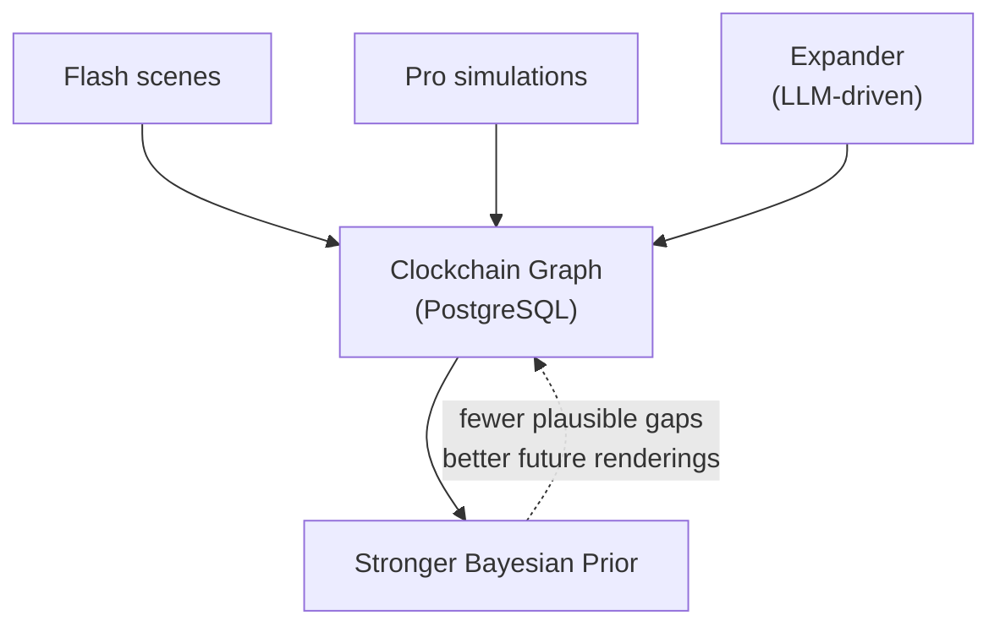

# Welcome to Timepoint Clockchain

Timepoint Clockchain is a PostgreSQL-backed directed graph of historical moments — a temporal causal graph for AI agents that reason about causality across time. Each node carries dialog, entity states, provenance, and confidence, addressed by a canonical spatiotemporal URL.

<Note>
**Why this exists** — AI agents that reason about causality across time currently rely on web search (noisy, unstructured), knowledge graphs (no temporal dimension), or hallucination. The Clockchain is a structured alternative: every node carries dialog, entity states, provenance, and confidence, addressed by a canonical spatiotemporal URL, in a format ([TDF](https://github.com/timepoint-ai/timepoint-tdf)) designed for machine consumption.
</Note>

## What is Clockchain?

The graph accumulates two layers of rendered reality:

- **Rendered Past** — historical events rendered by [Flash](https://github.com/timepoint-ai/timepoint-flash) with full causal structure, entity states, dialog, and source grounding
- **Rendered Future** — simulation outputs from [Pro](https://github.com/timepoint-ai/timepoint-pro), scored for convergence, stored as TDF records

Each new event with causal edges tightens the Bayesian prior — fewer plausible things *could* have happened in the gaps — approaching asymptotic coverage of any historical period.

<Warning>
The name is conceptual. This is PostgreSQL, not a blockchain.
</Warning>

## Key Features

<CardGroup cols={2}>
  <Card title="Canonical URLs" icon="link" href="/concepts/canonical-urls">
    Every moment has a unique spatiotemporal address with 8 segments encoding when and where
  </Card>
  <Card title="Typed Edges" icon="diagram-project" href="/concepts/edge-types">
    Causal, contemporaneous, spatial, and thematic relationships between moments
  </Card>
  <Card title="Autonomous Growth" icon="robot" href="/workers/overview">
    LLM-driven workers expand the graph 24/7 by generating related events
  </Card>
  <Card title="TDF Interoperability" icon="share-nodes" href="/integration/tdf-format">
    All nodes exportable as TDF records for cross-service data interchange
  </Card>
</CardGroup>

## How It Works

The Clockchain serves as the central accumulation point for the Timepoint AI suite:

1. **Flash** renders historical scenes with full causal structure
2. **Pro** generates temporal simulations scored for convergence
3. **Expander** autonomously grows the graph by finding frontier nodes and generating related events
4. Each addition strengthens the Bayesian prior for better future renderings

## Core Architecture

The Clockchain is built on:

- **PostgreSQL** database with two tables: `nodes` and `edges`
- **FastAPI** service with RESTful endpoints
- **Four autonomous workers** (Renderer, Expander, Judge, Daily)
- **Canonical URL system** for spatiotemporal addressing
- **Auto-linking** for temporal, spatial, and thematic edges

## Use Cases

- **Temporal reasoning** for AI agents that need to understand causality
- **Historical knowledge graph** with full spatiotemporal grounding
- **Simulation validation** through causal convergence
- **Browse and discovery** of historical moments via REST API
- **Content generation** with Flash scene renderer integration

## Next Steps

<CardGroup cols={2}>
  <Card title="Quickstart" icon="rocket" href="/quickstart">
    Get up and running with Clockchain in minutes
  </Card>
  <Card title="Core Concepts" icon="book" href="/concepts/graph-architecture">
    Understand the graph architecture and data model
  </Card>
  <Card title="API Reference" icon="code" href="/api/overview">
    Explore the complete API documentation
  </Card>
  <Card title="Timepoint Suite" icon="layer-group" href="/integration/timepoint-suite">
    Learn about the full Timepoint AI ecosystem
  </Card>
</CardGroup>
